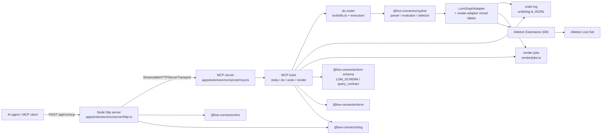
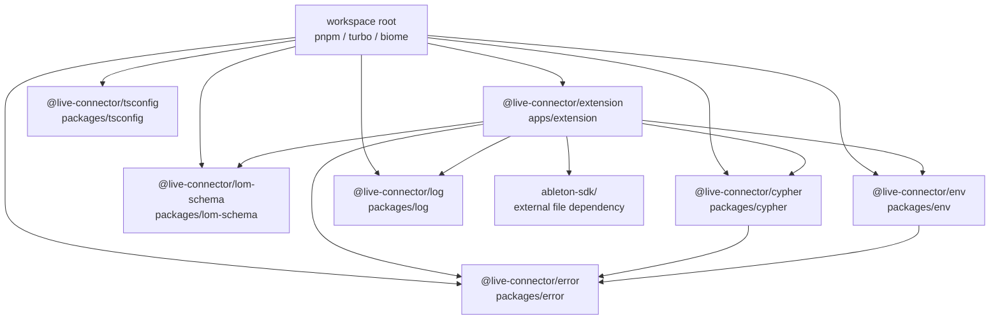
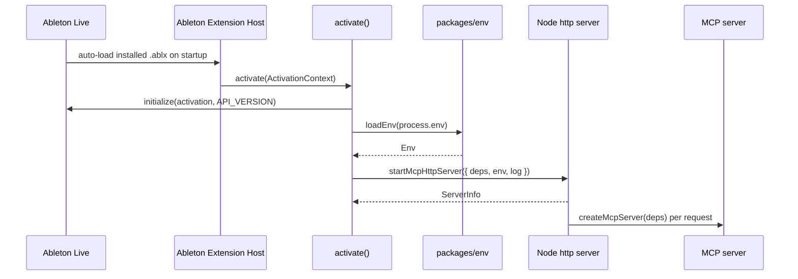
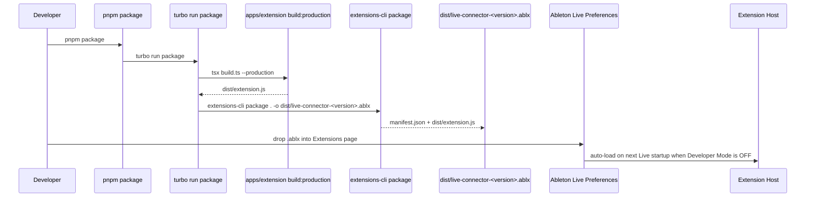
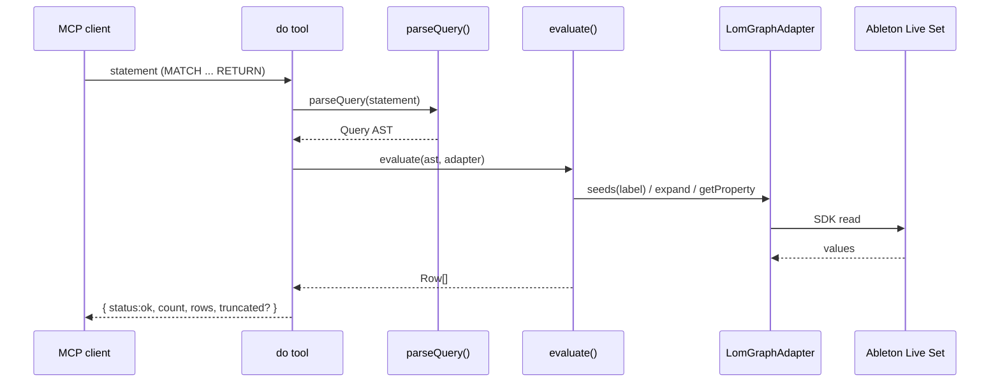
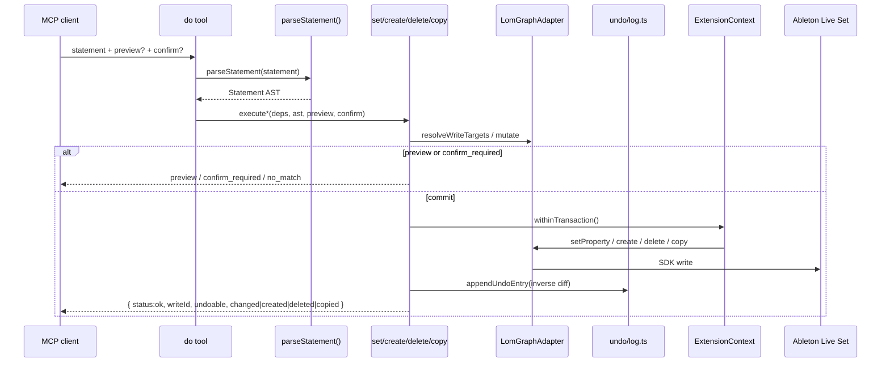
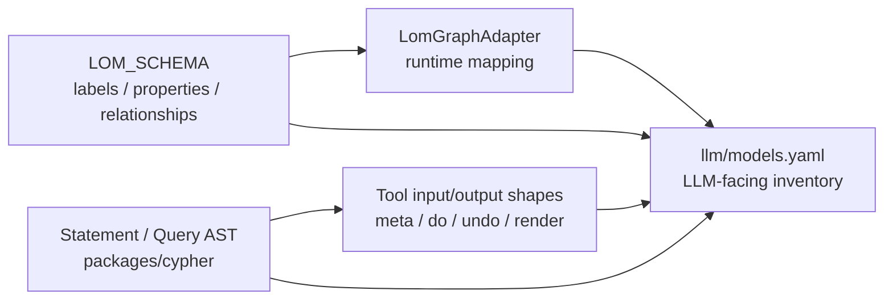

# live-connector Architecture

この文書は、現在の実装コードを基準に live-connector の構成、責務境界、実行時フローを記録する。データモデルの詳細は `llm/models.yaml` を正本とする。

## システム概要

live-connector は Ableton Extensions SDK 上で動作する Node.js extension である。Extension Host 内で Node.js 標準 `http` サーバーを起動し、`@modelcontextprotocol/sdk` 同梱の `StreamableHTTPServerTransport` 経由で MCP ツールを提供する。MCP ツールは Live Object Model (LOM) をプロパティグラフとして扱い、Cypher サブセットで読み取りと書き込みを行う。

## パッケージ境界

| パッケージ | 責務 |
| --- | --- |
| `apps/extension` | Ableton extension の起動、HTTP/MCP サーバー、4 MCP ツール登録、LOM adapter 実装、undo ログ、render ジョブ |
| `packages/cypher` | Cypher サブセットの tokenizer/parser/AST/evaluator。Ableton SDK へ依存しない |
| `packages/lom-schema` | LOM グラフスキーマ、ラベル、プロパティ、リレーション、例クエリ、do 文法契約の正本 |
| `packages/env` | 環境変数の zod 検証と型付き `Env` の提供 |
| `packages/error` | `AppError` 系のエラー定義、HTTP 用 RFC 9457 Problem Details 変換、MCP 用構造化エラー変換 |
| `packages/log` | scope 付き logger の生成と標準出力/標準エラーへの集約 |
| `packages/tsconfig` | 共有 TypeScript 設定 |

## 起動フロー

インストール型運用では Developer Mode を OFF にし、Live が管理する Extension Host がインストール済み `.ablx` を Live 起動時に自動ロードする。開発モードでは Developer Mode を ON にし、Live が管理する host を停止したうえで `extensions-cli run`（`pnpm --filter @live-connector/extension start` 経由）を使って開発者が Extension Host を起動する。

`activate()` は Ableton SDK の `initialize()` で `ExtensionContext` を得る。`loadEnv()` は loopback host と port を検証し、`startMcpHttpServer()` は `/health` と `/api/v1/mcp` を公開する。`/api/v1/mcp` は Host header が loopback host と設定 port に一致し、Origin header が存在する場合は loopback origin であるリクエストのみ受け付ける。

## 運用モード

| モード | Developer Mode | 起動主体 | 用途 | 変更反映 |
| --- | --- | --- | --- | --- |
| インストール型 | OFF | Ableton Live / Extension Host | 通常利用。CLI 起動不要 | `.ablx` 再インストール + Live 再起動 |
| 開発モード | ON | `extensions-cli run` | build 後の高速リロード | `pnpm --filter @live-connector/extension start` |

Claude Code は project scope の HTTP MCP server として `claude mcp add --transport http live-connector http://127.0.0.1:7799/api/v1/mcp --scope project` で登録する。登録または URL 変更などの MCP 設定変更後は Claude Code 再起動が必要である。Live 再起動や `.ablx` 再インストールのみで URL が変わらない場合、Claude Code は同じ endpoint に再接続する。

## 配布フロー

`pnpm package` は root script から Turborepo の `package` task を実行する。`@live-connector/extension` の package script は production bundle を生成した後、`manifest.json` の `name` と `version` から `.ablx` の出力名を決め、SDK CLI の `extensions-cli package` に渡す。`.ablx` は `apps/extension/dist/` に生成される。インストール型運用では、生成済み `.ablx` を Ableton Live の Preferences → Extensions にドロップし、Developer Mode OFF の状態で Live を再起動する。

## HTTP エンドポイント

| method | path | 認証 | 用途 |
| --- | --- | --- | --- |
| `GET` | `/health` | なし | `application/health+json` のヘルスチェック |
| `POST` | `/api/v1/mcp` | loopback Host / Origin header 検証 | Streamable HTTP MCP endpoint |

## MCP ツール

| tool | 種別 | 説明 |
| --- | --- | --- |
| `meta` | read | サービス情報、LOM スキーマ、do 文法契約、例文、仮想ラベル、Live Set overview |
| `do` | read/write | Cypher 文による読み取り（MATCH … RETURN）と書き込み（SET / CREATE / DELETE / COPY） |
| `undo` | write | do 書き込みの逆操作を LIFO で適用（`steps` または `writeId`） |
| `render` | read/render | AudioTrack の arrangement pre-FX 音声を WAV にレンダリング（同期または `background:true`） |

## MCP メタデータ

`createMcpServer` は initialize 応答の `instructions` に運用規約の要約（推奨手順 meta→do read→do write→render→undo、時刻座標の 2 系統、ガードレール）を設定する。ツールには `withToolAnnotations` facade で `TOOL_ANNOTATIONS`（`apps/extension/src/server/annotations.ts`）に基づく annotations を注入する: `meta` は `readOnlyHint`、`do` / `undo` は `destructiveHint`、`render` は非破壊。ミキサーの volume / panning / send は `(Track)-[:HAS_MIXER]->(Mixer)-[:HAS_VOLUME|HAS_PAN|HAS_SEND]->(Parameter)` として `do` SET `Parameter.value` で書き込む。

## 読み取りフロー

`packages/cypher` は SDK 非依存の `GraphAdapter<N>` 越しにグラフを評価する。`LomGraphAdapter` は Ableton SDK オブジェクトを `LomNode` として包み、LOM schema に定義されたラベルとプロパティへ変換する。`create-adapter.ts` は仮想ラベル `WriteEvent`（undo ログ）と `RenderJob`（render ジョブ）を query 可能にする。

## 書き込みフロー

`do` は `parseStatement` で read / set / create / delete / copy を分岐する。書き込みは差分のみ返し、マッチ 0 件は `{status:"no_match"}`。全書き込みは inverse diff を undo ログへ記録し、`undoable`（full / partial / none）を宣言する。`partial` / `none` は `confirm:true` 必須。

## 一括書き込み（batch）

v3.0.0 で廃止。複数ノードへの `MATCH … SET` が単一トランザクションで代替される。旧 `batch` は `set_*` / `write_notes` を 1 undo ステップに束ねる手続き集約レイヤだったが、undo ログ一本化により不要となった。

## 巻き戻し（undo ログ）

SDK v1.0.0-beta.0 には undo / redo を実行する API が無い（`ExtensionContext` はトランザクションの undoable 性を記述するのみ）。v3.0.0 ではスナップショット機構に代わり、**inverse diff 合成**による MCP 側 undo を提供する。

- 永続化: `environment.storageDirectory/undo/undo-log.jsonl`（JSONL、最大 200 件ローテーション）
- 各書き込みは `writeId` と `inverse[]`（`set_properties` / `notes_replace` / `delete_created` / `recreate`）を記録
- `recreate` は `RecreateBlueprint`（arrangement/session clip、device、note、cue_point、scene）で削除対象を再作成
- `undo` ツールは LIFO（既定 `steps:1`）。`writeId` 指定も可。undo 自体は新しい undo エントリを作らない
- `undoable`: `full`（完全復元可）/ `partial`（一部属性喪失の可能性、confirm 必須）/ `none`（復元不可、confirm 必須）
- 照会: 仮想ラベル `WriteEvent`（`do` read: `MATCH (e:WriteEvent) RETURN e`）

upstream（Ableton Extensions SDK）への undo / redo API 追加要望は本機構の前提であり、追加され次第この代替を置き換える。

## upstream（Ableton Extensions SDK）への要望

SDK v1.0.0-beta.0 に不足しており、本リポジトリが回避策・scope 縮小で代替している API の一覧。追加され次第、対応する代替を置き換える。

- **undo / redo API**: 上の「巻き戻し（undo ログ）」を参照。inverse diff 機構はこの欠如の代替である。
- **MIDI トラックの render / freeze / resample API**: `llm/midi-audition.md` の「真の解決（upstream）」を参照。手動 resample 前提の置き換え。
- **トラック生成の挿入位置引数**: `Song.createMidiTrack()` / `Song.createAudioTrack()` は挿入位置（index）を受け取らず、生成位置は「最後に選択されたトラックの直後（未選択なら末尾）」に固定される。`do` CREATE Track はこの制約により挿入位置指定を提供できない。
- **選択状態（selection）の読み取り・設定 API**: トラックの生成位置が選択状態に依存する一方、SDK から選択トラックを読むことも設定することもできないため、生成位置を制御も予測もできない。
- **トラック移動（並べ替え）API**: 生成後に意図した位置へ移動する代替も、トラックの並べ替え API が無いため取れない。

## データ所有

`llm/models.yaml` は実装の代替ではなく、LLM が参照するモデル目録である。TypeScript 型や zod schema を変更した場合は、対応する項目を更新する。

## 現在の制約

- MCP tool error は `toMcpError()` により `{ error, detail, hint?, validProperties?, validRelationships?, validStartLabels? }` 形式で返る。HTTP の `status` / `type` / `instance` は MCP tool error には含めない。
- HTTP 層のエラーは `toProblemDetails()` により RFC 9457 Problem Details 形式を維持する。
- `do` read の `RETURN` は射影・集計・ORDER BY / SKIP / LIMIT に対応。LIMIT 省略時は 500 行で truncate。
- `Clip.startTime` / `startMarker` / `endMarker` は arrangement 配置の SET で変更可能（`arrangement-edit.ts`）。カスタム warp grid 等は `undoable: partial` として申告される。
- Ableton Extensions SDK には Browser API とネイティブプリセット読込 API が無い。third-party plug-in preset の適用は対象外。
- Device parameter の保存・復元専用ツールは廃止。`do` read で Parameter 値を取得し、`do` SET で再適用する。
- Cypher サブセットは `MATCH ... RETURN`（読み取り）、`MATCH ... SET / CREATE / DELETE / COPY`（書き込み）、有向 relationship、可変長 hop、基本比較演算を対象にする。
- `LomGraphAdapter.seeds()` で開始できるラベルは `Song` / `Track` family / `Clip` family / `Device` family / `Scene` / `CuePoint` / 仮想 `WriteEvent` / `RenderJob` である。
- `ableton-sdk/` は外部配布物であり、workspace には同梱しない。
- SDK は Live Set の名称・ファイルパスを公開しない。接続先の変化は `meta` overview / `/health` の構造ダイジェストと `songHandle` の変化で検知する。
- SDK に MIDI トラックの合成出力を audio 化する手段は無い。`render`（`renderPreFxAudio`）は AudioTrack の pre-FX 音声のみ対象。MIDI 楽器の実音検証は手動 resample が前提（`llm/midi-audition.md`）。
